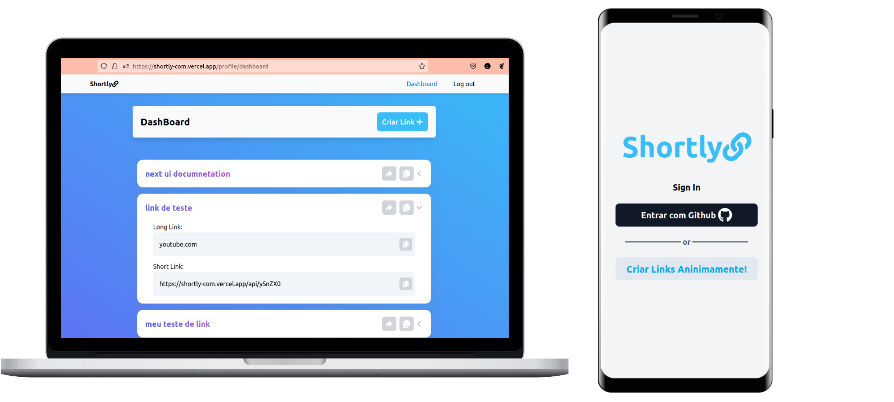

<h3 align="center">


</h3>

## Descrição 📕

O shortly é um projeto criado para que os usuários possam encurtar links de forma simples e rápida. Ele foi construído usando tecnologias modernas para oferecer a melhor experiência possível, como o Next, NextAuth, tailwind e o NextUI. Essas soluções permitem uma configuração simplificada do site juntamente com recursos robustos e segurança de primeira linha. O Shortly tem um layout responsivo pelo qual pode ser facilmente acessado em diferentes dispositivos móveis.

<h3 align="center">

<a href="https://shortly-com.vercel.app/" />

«Acessar Website»

</a>

</h3>

## Preview 🕶️

<p align="center">



</p>

## Como Rodar 🚀

Para rodar em desenvolvimento basta baixar os arquivos do projeto via zip ou `git clone`. Após isso basta baixar as dependências e rodar o código em desenvolvimento:

```bash
> npm i
> npm run dev
```

Antes de subir a aplicação é necessário subir um banco de dados de preferência MySQL e também criar um app no github. Com os prerequisitos compreendidos, basta preencher o arquivo `.env` de acordo com o arquivo [.env.example](./.env.example)

```.env
DATABASE_URL='db'
GITHUB_ID='id'
GITHUB_SECRET='secret'
NEXT_PUBLIC_API="https://api.com/"
```

## Rodar testes 🧪

Essa aplicação possui testes de componentes usando a biblioteca [testing library](https://testing-library.com/) e [jest](https://jestjs.io/pt-BR/). Para rodar os testes basta rodar o comando. Para rodar os testes basta rodar o comando:

```bash
> npm run test
```

Para caso de desenvolvimento:

```bash
> npm run test:dev
```

Também é possível rodar os testes usando docker 🐋:

```bash
> docker build -t next-test .
> docker run next-test:latest
```

### Todo ✅

-   [ ] Componentizar melhor o app
-   [x] Adicionar testes de componente com [testing library](https://testing-library.com/)
-   [x] Adionar um readme
-   [ ] Adicionar um favicon
-   [x] Simple ci for tests
-   [ ] Adicionar domínio para tentar encurtar o link

## Ferramentas Utilizadas 🛠️

<p align="center">
    
    
    
    
    
    
    
    
    
    
    

</p>

## Entre em contato 📞

<br>

<p align="center">
<a href="https://www.linkedin.com/in/luis-felipe-vanin-martins-5a5b38215">

</a>
<a href="mailto:luisfvanin2@gmail.com">

</a>
</p>
```
